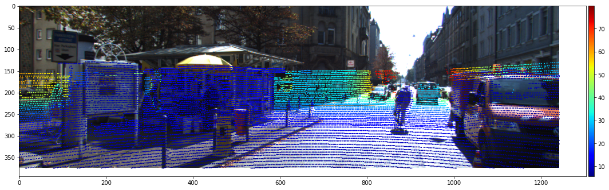
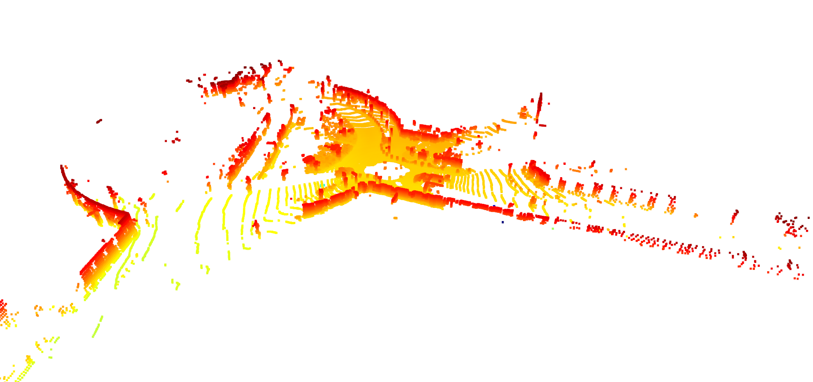
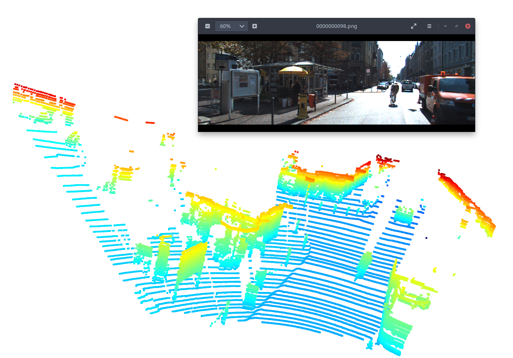

# Mapping LiDAR point cloud to camera image frame

This repository aims to be a short guide to map LiDAR point clouds to a camera image frame in the [Kitti dataset](http://www.cvlibs.net/datasets/kitti/). 

## Description

Robotics-vision in a crucial task to endowing autonomous driving vehicles with environmental awareness. Without robust perception pipelines, it would be impossible to obtain reliable decision-making systems. This notebook aims to be a short guide and teach how to map a LiDAR point cloud to an image frame synchronize at the same timestamp.

The notebook is divided in the following sections:

 - Loading images, point clouds and transformation matrices
 - Transforming Point cloud to camera image frame
 - Filtering the point cloud and aligning

## Dependencies

 - pykitti
 - numpy
 - cv2
 - matplotlib
 - open3d

Special thanks to [JohanSamir](https://github.com/JohanSamir) for providing this awesome notebook.

